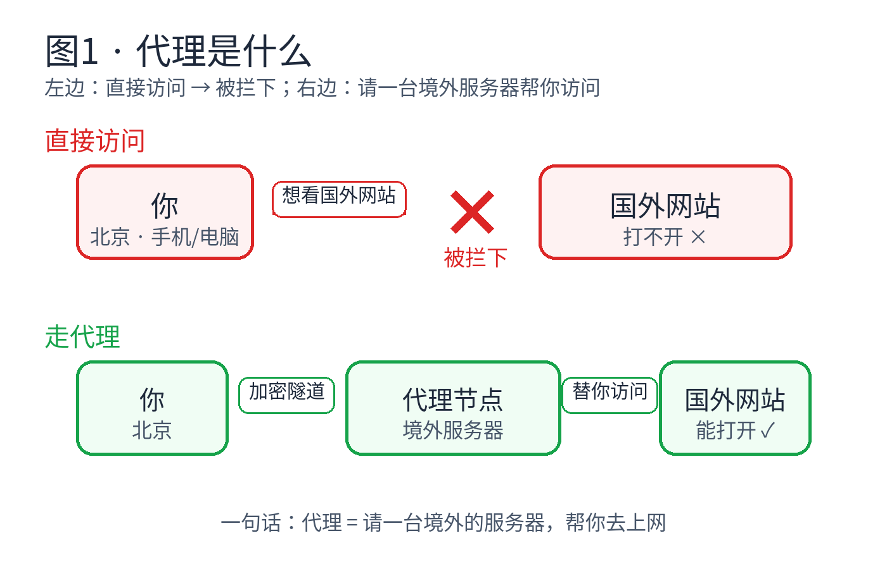
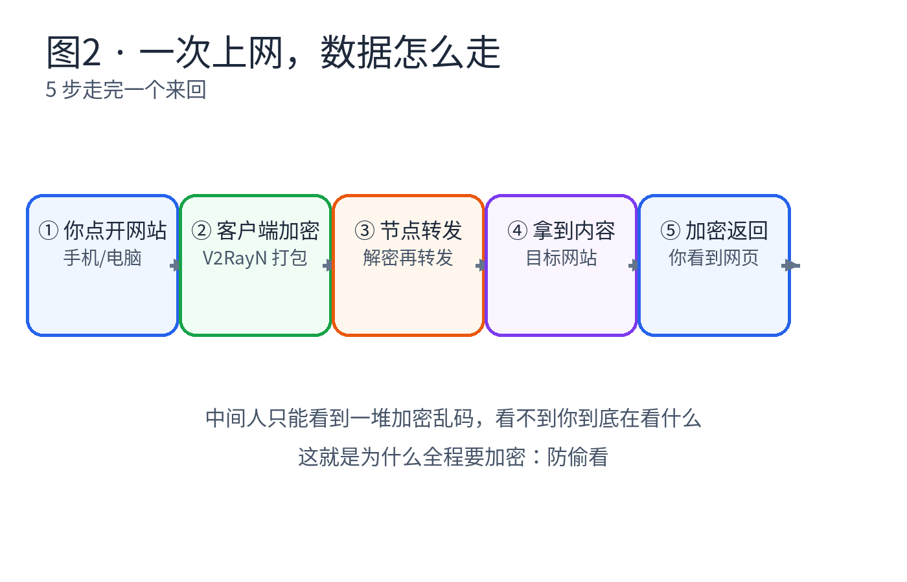
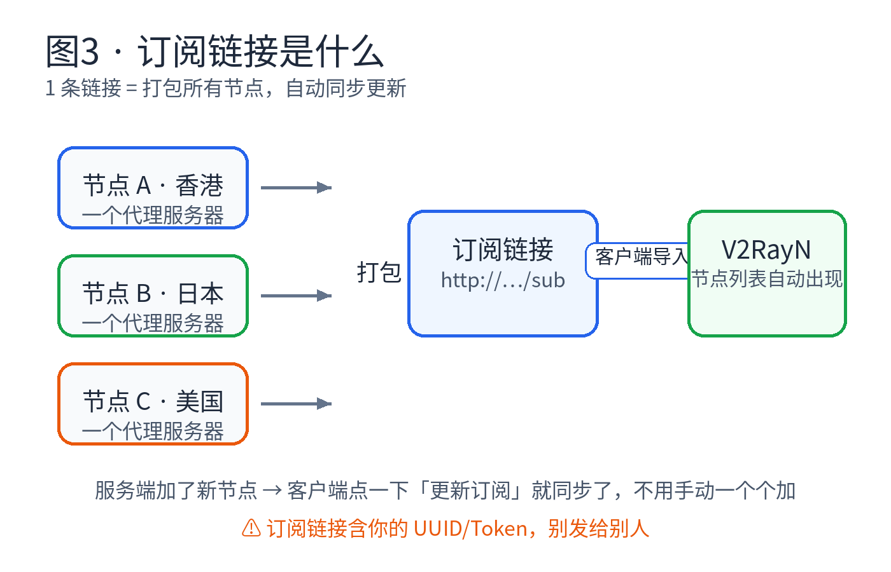
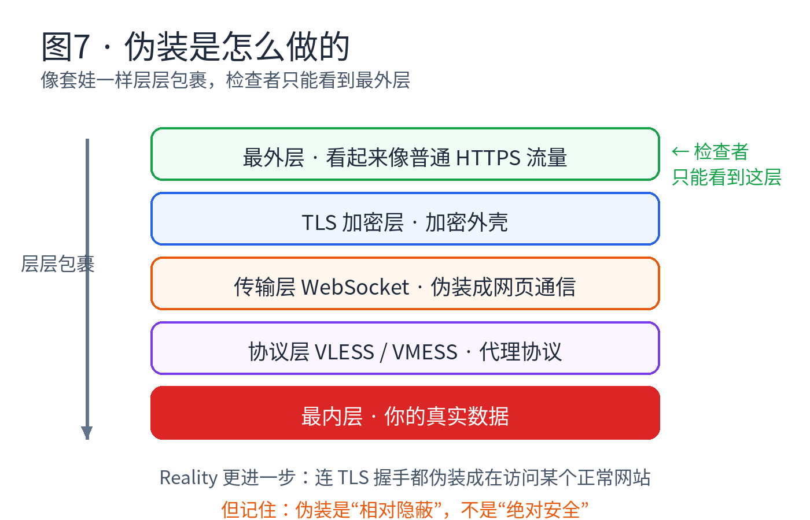
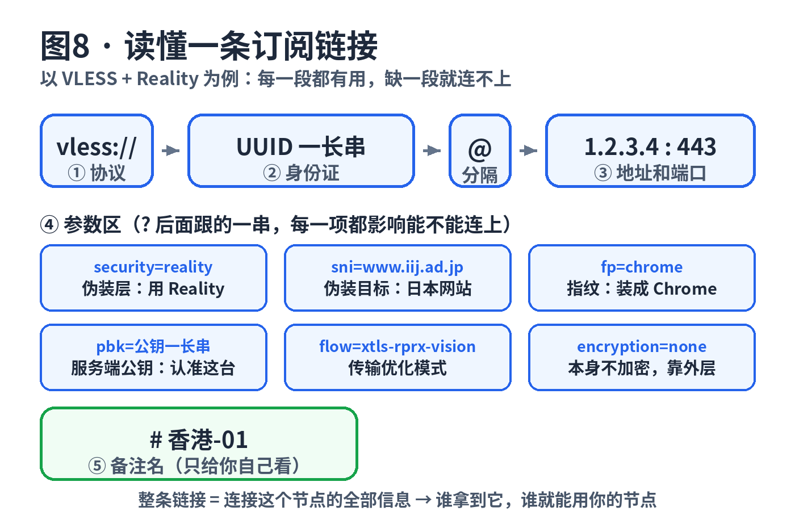
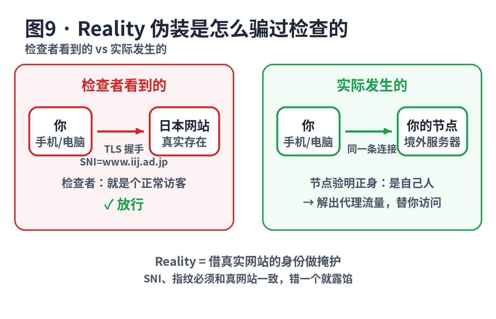
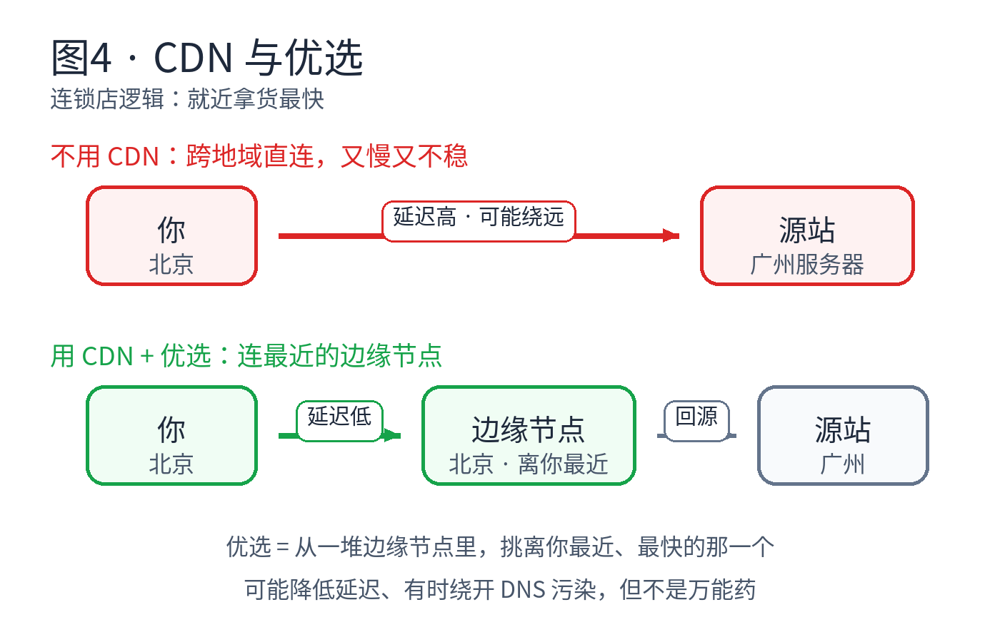
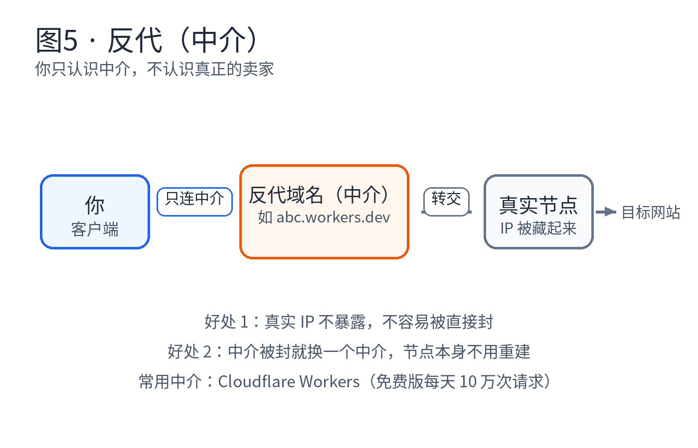
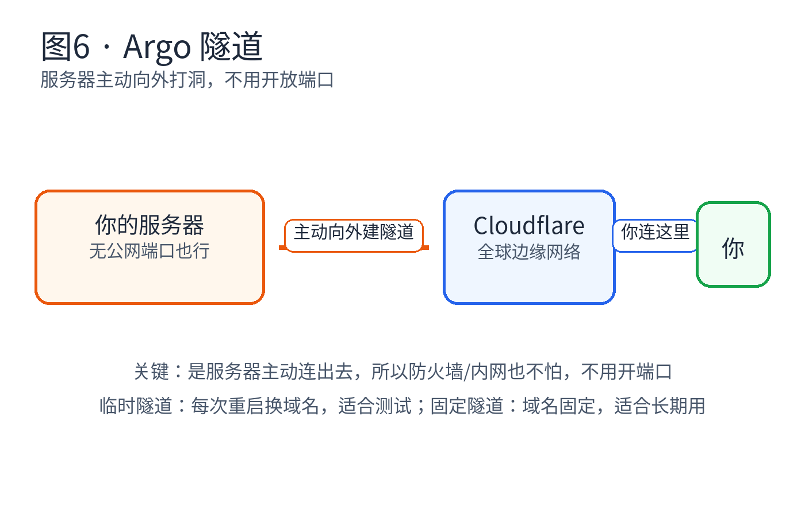
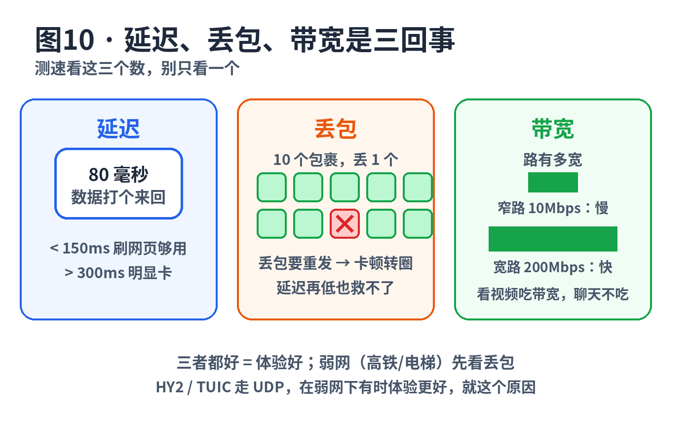

# 00 · 先看这篇：前置知识（图文版）

> 读完这篇（约 20 分钟），你能明白：代理到底是什么、数据怎么走、
> 客户端/节点/订阅是什么关系、8 种协议各有什么用、
> **能自己读懂一条订阅链接的每个参数**、SNI/指纹/Reality 到底在干什么、
> CDN/优选/反代/Argo 是什么、测速看哪三个数、凭证安全。
> 每节都有图，看图再看字。

---

## 1. 代理是什么

**一句话：请一台境外的服务器，帮你去上网。**



- 直接访问：你的请求直奔国外网站，半路被拦下，打不开。
- 走代理：你的请求先走**加密隧道**到境外节点，节点替你访问，再把内容加密送回来。

**记住两点：**
1. 节点是"跑腿的"，真正访问网站的是它，不是你。
2. 你和节点之间是加密的，中间人只能看到乱码，看不到你在看什么。

---

## 2. 一次上网，数据怎么走



5 步走完一个来回：

| 步骤 | 谁在干活 | 干了什么 |
|---|---|---|
| ① 你点开网站 | 你（手机/电脑） | 发出一个普通的上网请求 |
| ② 客户端加密 | V2RayN 等客户端 | 把请求**打包加密**，塞进隧道 |
| ③ 节点转发 | 境外服务器 | **解密**，理解你要什么，然后替你去要 |
| ④ 拿到内容 | 目标网站 | 网站把内容给节点（它以为访问者就是节点） |
| ⑤ 加密返回 | 节点 → 客户端 | 内容**加密**原路返回，客户端解密后显示给你 |

**为什么非要加密？** 因为从你家到境外节点的这段路，要经过很多中间设备。
不加密，中间人一眼就看到你在看什么；加密了，他们只能看到一堆乱码。
这就是"防偷看"——注意是**防偷看内容**，不是让你隐身。

---

## 3. 四个主角：客户端、节点、服务器、订阅

这四个词最容易搞混，一次讲清：

- **服务器**：一台机器，可以是你买的 VPS，也可以是白嫖的游戏机/PaaS。
- **节点**：跑在服务器上的**代理程序**。一台服务器可以跑多个节点。
- **客户端**：你手机/电脑上的软件（如 V2RayN），负责连节点、加解密。
- **订阅**：一条链接，把**所有节点信息打包**在一起（见下图）。



**订阅解决什么问题？** 没有订阅，你要手动一个个加节点，地址端口 UUID 填到手酸。
有了订阅：导入 1 条链接 → 所有节点自动出现 → 服务端加了新节点，你点一下"更新订阅"就同步了。

订阅链接有两种样子：一条 `https://...` 网址（点开是一堆 base64 乱码，客户端能解开），
或者直接就是 `vless://...` 这种节点链接。**两种里面都藏着你的全部凭证**，
这就是第 14 节要讲的安全问题。

> ⚠️ 订阅链接里含你的 UUID / 密码，**谁拿到谁就能用你的节点、烧你的流量**。别发群里，别截图外发。

---

## 4. 身份类：UUID、密码、SNI、Token

- **UUID**：节点的"身份证号"，格式 `xxxxxxxx-xxxx-xxxx-xxxx-xxxxxxxxxxxx`。
  VLESS / VMess / TUIC 用它认人。每个节点必须唯一，两个节点用同一个 UUID，客户端会分不清。
  **自己用在线 UUID 生成器生成一个**，别用别人分享的。
- **密码**：Trojan / Shadowsocks / Hysteria2 用密码认人，不是 UUID。
  效果一样：对不上就拒绝连接。
- **SNI**：TLS 握手时报上的"我要访问的域名"。节点靠它**伪装**成在访问某个正常网站。
  详细原理见第 8 节。
- **订阅 Token**：给订阅链接加的密码，防止别人偷刷你的订阅。

一句话：**UUID 和密码就是钥匙，SNI 和 Token 是配合演戏的道具。**

---

## 5. 协议三件套：协议、传输、伪装

新手最晕的就是 VLESS / WS / TLS / Reality 一堆词。其实它们是三层不同的东西，
像套娃一样包在一起（见下图）：



| 层 | 是什么 | 举例 |
|---|---|---|
| **协议层** | 代理"说话的方式"，定规矩 | VLESS、VMESS、Trojan、Shadowsocks、Hysteria2、TUIC |
| **传输层** | 数据"坐什么车" | WS（WebSocket，伪装成网页通信）、TCP、UDP/QUIC、gRPC |
| **伪装/加密层** | "穿什么衣服"，防偷看+防认出 | TLS（加密外壳）、Reality（连握手都伪装成正常网站） |

**怎么搭配？** 常见组合：`VLESS + Reality`、`VMESS + WS + TLS`、`Hysteria2`（自带 QUIC）。
选协议不用背，看 [01-怎么选](01-怎么选-30秒决策.md) 的推荐表就行。

---

## 6. 协议逐个看（本项目用到的 8 种）

每个协议一句话讲清：**靠什么认人、有什么特点、在本项目哪里出现**。

| 协议 | 靠什么认人 | 一句话特点 | 本项目哪里用 |
|---|---|---|---|
| **VLESS** | UUID | 轻量，本身不加密，全靠外层 TLS/Reality | sbx 系主力，deploy-vercel 也有 |
| **VMess** | UUID + 时间戳 | 自带加密，客户端时间不能差太多（防重放） | sbx 系、deploy-vercel |
| **Trojan** | 密码 | 把流量伪装成普通 HTTPS，连不上时还能 fallback 到真网站 | sbx 系、deploy-vercel |
| **Shadowsocks** | 密码 + 加密方法 | 老牌，简单快；注意 deploy-vercel 的 SS 用 `method=none`，**不加密**，只靠 WS 路径挡人（源码实测结论） | deploy-vercel |
| **Hysteria2** | 密码 | 基于 QUIC（UDP），弱网（高铁/电梯）下体验可能更好 | sbx 系、deploy-vercel |
| **TUIC** | UUID + 密码 | 也是 QUIC，弱网好；Serv00 版源码里密码固定 `admin123`，**必须改** | sbx 系 |
| **AnyTLS** | 密码 | 新协议，基于 TLS，配置简单 | deploy-vercel |
| **SOCKS5** | 用户名密码（可无） | 最老，无加密，**别直接暴露到公网** | sbx 系附带 |

**新手怎么记？** 记住三类就行：
1. **UUID 类**（VLESS/VMess/TUIC）：钥匙是一长串身份证号。
2. **密码类**（Trojan/SS/HY2/AnyTLS）：钥匙是一个密码字符串。
3. **UDP 类**（HY2/TUIC）：坐 UDP 的车，弱网可能更稳，但需要 UDP 端口能通。

**关于"UDP 抗丢包"：** Hysteria2 / TUIC 走 UDP/QUIC，在 WiFi 信号差、高铁上这种**弱网环境**下体验可能更好。
但这不叫"抗丢包"，只是换了条路，没有魔法。原理见第 13 节。

---

## 7. 读懂一条订阅链接（核心技能）

订阅链接不是乱码，是一份"连接说明书"。以下面这条 VLESS + Reality 为例：



```
vless://UUID@1.2.3.4:443?encryption=none&security=reality&sni=www.iij.ad.jp
  &fp=chrome&pbk=公钥&sid=短ID&flow=xtls-rprx-vision&type=tcp#香港-01
```

一段一段看：

| 段 | 例子 | 意思 |
|---|---|---|
| 协议头 | `vless://` | 用 VLESS 协议说话 |
| 身份 | `UUID` | 钥匙，对不上服务端拒绝你 |
| 地址端口 | `1.2.3.4:443` | 节点在哪，敲哪扇门（443 是 HTTPS 常用端口，不显眼） |
| `type=tcp` | 传输层 | 数据坐什么车 |
| `security=reality` | 伪装层 | 穿 Reality 这件衣服 |
| `sni=www.iij.ad.jp` | 伪装目标 | 握手时自称在访问这个日本网站 |
| `fp=chrome` | 指纹 | 握手细节装成 Chrome 浏览器（第 8 节） |
| `pbk=...` | 服务端公钥 | 认准这台服务器，防冒充 |
| `flow=xtls-rprx-vision` | 传输优化 | 一种性能优化模式 |
| `encryption=none` | 不加密 | VLESS 本身不加密，加密全靠外层的 Reality |
| `#香港-01` | 备注 | 只给你自己看的名字 |

**其它协议的链接长得不一样，但结构一样**（协议头 + 身份 + 地址 + 参数 + 备注）：

- Trojan：`trojan://密码@host:443?sni=www.iij.ad.jp#备注`
- VMess + WS：`vmess://` 后面跟一串 base64，解开是 JSON，里面有 `path`（WS 路径）、`host`（伪装的域名）等字段
- Shadowsocks：`ss://base64(加密方法:密码)@host:端口#备注`

**为什么参数不能手改？** 每个参数都要和服务端配置**严丝合缝**对上。
比如 Reality 的 `pbk` 是服务端私钥配对的公钥，你改一个字符，服务端就认不出你。
所以：**节点连不上时，别乱改订阅链接，先去看 [08-排错手册](08-排错手册.md)。**

---

## 8. SNI、指纹与 Reality（伪装是怎么实现的）

### 8.1 TLS 握手：SNI 是明文的

你访问一个 HTTPS 网站时，第一步叫 **TLS 握手**：
客户端先打招呼，报上"我要访问的域名"——这就是 **SNI**，而且**它是明文的**，
路上任何检查设备都能看到。

这就带来一个问题：加密做得再好，检查者也能看到你在访问哪个域名。
Reality 的思路是：**那我就报一个正常网站的域名，让它以为我在刷网页**。

### 8.2 指纹：光报名字不够，口音也得像

TLS 握手有很多细节（用的密码套件顺序、扩展字段等），
Chrome、Firefox 发起的握手各有各的"口音"，这叫**指纹**。
如果你自称在用 Chrome 访问网站，但握手"口音"不像 Chrome，检查者就会起疑。

所以订阅链接里有 `fp=chrome`：让客户端**模仿 Chrome 的握手细节**，
名字和口音都对上，才像真的。

### 8.3 Reality：借真实网站的身份做掩护



- **检查者看到的**：一次普通的 TLS 握手，SNI 是 `www.iij.ad.jp`（真实存在的日本网站），
  指纹像 Chrome → "就是个正常访客，放行"。
- **实际发生的**：同一条连接连的是你的节点，节点用密钥验证"这是自己人"，
  然后解出真正的代理流量。

**Reality 要对上三样东西**，缺一不可：
1. **SNI** 指向一个真实存在、支持 TLS 的网站；
2. **指纹**（`fp`）和真实浏览器一致；
3. **密钥对**（服务端的私钥 ↔ 订阅里的 `pbk` 公钥、`sid`）能对上。

### 8.4 自签证书：为什么 HY2 要"跳过验证"

Hysteria2 / TUIC 这类 QUIC 协议常用**自签证书**（自己给自己发的证书，
系统不信任它）。客户端连接时有两种选择：

- **填证书指纹（pin）**：认准这张证书，最稳；
- **跳过验证（insecure）**：不验证对方身份，能连就行。

跳过验证 = 你不检查对方是不是真的你的节点，**中间人可以冒充**。
自己搭的节点，风险自担问题不大；**用别人分享的节点还跳过验证，就要小心了**。

**Reality 是什么？** 一种伪装技术：TLS 握手时伪装成在访问某个真实存在的正常网站，
让检查者以为你只是在刷网页。**相对隐蔽，不是绝对安全**——原版说"反检测最强"太绝对了。

---

## 9. CDN 与优选

**CDN = 内容分发网络**，记住"连锁店"比喻：你在北京买东西，去北京的店拿，不用等广州发货。
CDN 就是在全球放了很多"分店"（边缘节点），让你就近访问。



**翻墙里套 CDN 干嘛？**
1. **隐藏真实 IP**：别人只能看到 CDN 的 IP，看不到你节点的真实 IP。
2. **看着像正常流量**：你的流量混在 CDN 的正常流量里，相对不显眼。
3. **可能更快**：连离你近的边缘节点，延迟低。

### 优选：为什么挑个 IP 能变快

Cloudflare 的边缘 IP 是 **anycast**：同一个 IP 在全球很多地方同时广播，
运营商会自动把你送到**离你最近**的接入点。但"最近"不等于"最快"，
有的接入点绕路、有的拥堵。

**优选 = 从一堆边缘 IP 里，实测挑一个到你这里最快、丢包最少的**，填进 `CFIP` 变量。
效果：**可能**降低延迟，**有时**能绕开 DNS 污染。但它不是万能药，节点该慢还是慢。

**DNS 污染是什么？** 域名解析被篡改，你查一个域名的 IP，拿到的是假地址，自然连不上。
换优选/换解析方式**有时**能缓解，因为走了另一条解析路径。

---

## 10. 反代（中介）

**反代 = 反向代理**，记住"中介"比喻：
你找中介买东西，中介去找真正的卖家。你只知道中介的地址，**不知道卖家在哪**。



**什么时候需要反代？** 比如 deploy-vercel 项目：Vercel 分配的 `*.vercel.app` 域名在部分地区可能直接连不上，
就套一层 Cloudflare Workers 做中介，客户端连中介，中介转发给 Vercel。

**两个好处：**
1. 真实节点 IP 不暴露，不容易被直接封。
2. 中介被封了就换一个中介，节点本身不用重建，恢复快。

常用中介：Cloudflare Workers（免费版每天 10 万次请求，个人用一般够）。

---

## 11. Argo 隧道

**一句话：服务器主动向外打洞，不用开放端口。**



正常情况：别人要连你的服务器，你的服务器得开放端口等人来。
Argo 反过来：**服务器主动向 Cloudflare 建一条加密隧道**，你连 Cloudflare 就行了。

**好处：** 游戏机、家里宽带这种没有公网端口的环境也能用，防火墙/内网都不怕。

**两种隧道：**
- **临时隧道**：每次重启换新域名，零配置，适合测试。
  域名从哪来？cloudflared 启动后会在日志（`boot.log`）里打印
  `https://xxx.trycloudflare.com`，脚本用正则把它抓出来，拼进订阅链接。
- **固定隧道**：域名固定（要填 `ARGO_DOMAIN` + `ARGO_AUTH`），适合长期用。
  `ARGO_AUTH` 可以是 token，也可以是 JSON 密钥文件的内容。

---

## 12. 运维三件套：哪吒、保活、TG 推送

- **哪吒面板**：服务器监控面板，看节点在线/离线、流量、CPU/内存。
  - v0：`NEZHA_SERVER` 填 host（如 `nz.example.com`），`NEZHA_PORT` 填 agent 端口（如 `5555`）
  - v1：`NEZHA_SERVER` 填 `host:port`（如 `nz.example.com:8008`），`NEZHA_PORT` 留空
  - `NEZHA_KEY` 去哪吒面板后台获取，每个节点一个，是密钥，别泄露
- **保活**：免费平台会回收"长期没动静"的服务器，所以要定时搞点动静（自动访问、假人插件）。
  记住：保活是**降低被回收的概率**，不是免死金牌。
- **假人插件**：MC 服务器用的插件，模拟玩家在线，让游戏机觉得"这服务器有人用"。
  完整用法见 [13-Java版假人保活](13-Java版假人保活.md)。
- **TG 推送**：节点上线/下线时发 Telegram 通知你。找 @BotFather 建 Bot 拿 `BOT_TOKEN`，再拿到自己的 `CHAT_ID`。

---

## 13. 延迟、丢包、带宽是三回事

测速时别只看一个数，看这三个：



| 指标 | 比喻 | 多少算好 | 影响什么 |
|---|---|---|---|
| **延迟**（ms） | 快递打个来回要多久 | < 150ms 刷网页够用，> 300ms 明显卡 | 打开网页、游戏操作跟手度 |
| **丢包**（%） | 10 个包裹丢了几个，丢了要重发 | 越低越好，> 5% 就会卡 | 视频转圈、语音断续 |
| **带宽**（Mbps） | 路有多宽 | 看视频 50Mbps 以上比较稳 | 下载速度、4K 视频 |

**三者都好 = 体验好。** 延迟低但丢包高，照样转圈——这就是弱网（高铁/电梯/地下室）卡的常见原因。
HY2 / TUIC 走 UDP，在弱网下有时体验更好，就是因为 QUIC 处理丢包更从容。

---

## 14. 安全：你的凭证都在链接里

第 7 节你已经会读订阅链接了，现在要明白它的另一面：
**整条链接 = 连接这个节点的全部信息。谁拿到它，谁就能用你的节点、烧你的流量。**

几个真实的坑（都来自本项目源码实测）：

1. **别分享订阅链接**：UUID、密码、地址端口全在里面。发到群里 = 把节点送人。
2. **UUID 自己生成**：Serv00 版默认 UUID 可由用户名派生出来，别人能猜到。
   务必改成随机生成的。
3. **默认密码必须改**：Serv00 版 TUIC 密码在源码里固定是 `admin123`，
   不改等于没锁门。
4. **TG 的 `BOT_TOKEN` 泄露**：别人能冒充你的 Bot 给你发消息，甚至操作你的 Bot。
5. **`NEZHA_KEY`、面板密码**：同理，都是钥匙，别进仓库、别截图。
6. **重启会丢文件**：sbx 系实现启动约 45 秒后会清理大部分运行文件，
   订阅和密钥**备份好**，不然重启后要重新下载配置（各项目文档里有提醒）。

一句话：**钥匙类东西（UUID/密码/Token），只存在你自己手里。**

---

## 15. 常见误区（原版没讲透的）

| 误区 | 真相 |
|---|---|
| "TLS 1.3 最强" | 加密强度看具体实现和配置，不是看版本号迷信 |
| "UDP 抗丢包" | 弱网下可能体验更好，没有魔法（见第 13 节） |
| "Argo 不拥塞" | 走 CF 边缘网络通常稳定，但高峰期照样堵 |
| "优选避免 DNS 污染" | 只是换条解析路径，有时有效，不是根治 |
| "CF 是合法的不会被墙" | 错。套 CDN 藏的是你的源站 IP，CF 的 IP 段本身也可能被针对 |
| "平台不检测" | 只是相对隐蔽，检测手段也在进化 |
| "一键解锁流媒体" | 不保证，IP 干净程度看运气 |
| "Reality 绝对安全" | 相对隐蔽；SNI 目标网站挂了、指纹对不上都会露馅 |
| "节点越多越好" | 订阅里几十个节点，常用的就 2-3 个，多的是备用 |
| "订阅链接可以分享" | 错，等于送节点 + 送流量（见第 14 节） |
| "延迟低 = 速度快" | 还要看丢包和带宽（见第 13 节） |
| "WS 路径越复杂越安全" | 路径只是门牌号，安全靠 TLS 和认证 |
| "跳过证书验证没关系" | 自己的节点问题不大；别人的节点有中间人冒充风险 |

---

## 自测 10 问（都会了再去部署）

1. 客户端、节点、服务器、订阅，分别是什么？什么关系？
2. UUID 是干嘛的？能不能两个节点用同一个？
3. 协议层、传输层、伪装层，分别举一个例子？
4. 一条 `vless://` 链接里，`sni` 和 `fp` 分别是干嘛的？
5. 一句话说出 Reality 骗过检查的原理。
6. 反代解决什么问题？中介被封了怎么办？
7. Argo 隧道为什么不用开放端口？临时隧道的域名从哪来？
8. 看视频卡顿，应该先看延迟、丢包、带宽里的哪个？
9. 为什么订阅链接不能分享？
10. HY2 用自签证书时，客户端为什么有个"跳过验证"选项？有什么风险？

都答得上来 → 去 [01-怎么选](01-怎么选-30秒决策.md) 挑项目开干。
