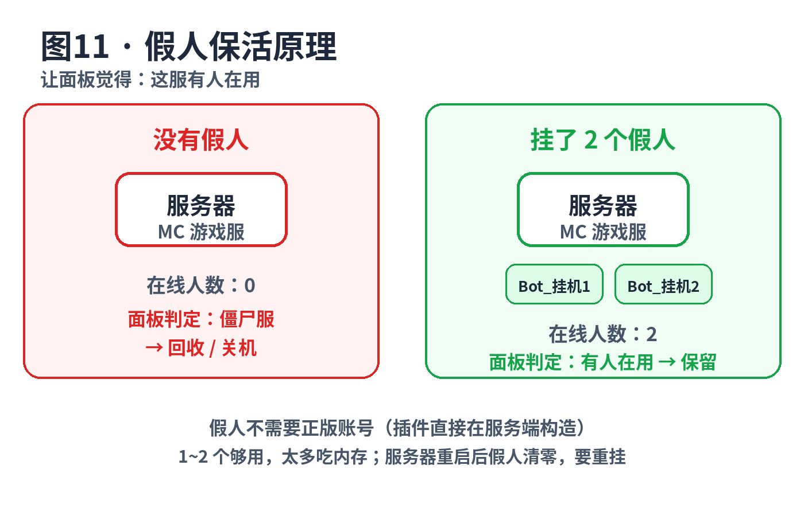

# 13 · Java 版假人保活：怎么用

> 适用：paper-pro 这类开在**免费游戏机**上的 Java 版服务器。
> 目标：让面板觉得"这服有人在用"，降低被回收/关机的概率。
> 先说清楚：**保活是降低被回收的概率，不是免死金牌**；先看面板规则，有的面板明令禁止假人。

---

## 1. 一句话：假人保活是干嘛的



免费游戏机面板判断"这服有没有人用"，最简单的办法就是看**在线人数**。
长期 0 人在线 → 判定为"没人用的僵尸服" → 回收/关机。

**假人 = 模拟出来的在线玩家**：进 Tab 列表、算在线人数、能走动说话，
面板看到的在线人数 > 0，就不会把它当僵尸服处理。

---

## 2. 三种方案，先选一种

| 方案 | 原理 | 优点 | 缺点 | 适合谁 |
|---|---|---|---|---|
| **插件式**（FakePlayer CE / FPP） | 插件在服务端**直接构造**一个假玩家 | 不需要正版账号；进 Tab 列表、算人数；命令控制 | 要装插件；重启后假人消失，要重挂 | 大多数 Paper/Purpur 服，**推荐** |
| **换核心**（Leaves） | 换成自带假人系统的服务端核心 | 内置 `/bot`，不用另装插件 | 要换整个服务端核心，迁移成本高 | 本来就想换核心的人 |
| **外部客户端**（fakebot 等） | 另起一个程序，**以真实客户端身份**连进服 | 服务端零侵入，不装任何东西 | 要另外一台机器一直开着跑它；正版服需要真账号 | 不能动服务端文件时 |

**Carpet 模组的 `/player` 呢？** 那是 Fabric 模组的功能，Paper 装不了，
paper-pro 是 Paper 系，别找了。

下面以**插件式**为主讲，这是 paper-pro 用户最常用的。

---

## 3. 实操：FakePlayer CE（推荐）

选它的理由：一个 jar 通吃 MC `1.20.1 ~ 26.2`，Paper/Purpur 都能用，
不用按版本找包；还自带 HTTP 接口，方便做自动补假人。

> 项目地址：[EndlessPixel-Studio/FakePlayer-CE](https://github.com/endlesspixel-studio/fakeplayer-ce/blob/HEAD/README.md)
> （社区维护版，原项目是 FakePlayer；去 GitHub Releases 页下 stable 包）

### 3.1 安装（5 分钟）

1. **先装前置插件 CommandAPI**：FakePlayer CE 依赖它。
   去下载 CommandAPI（注意：**别装 `10.0.0` 这个版本**，官方明确说这个版本不行），
   jar 丢进 `plugins/`。
2. **下载 FakePlayer CE**：Release 页下 `fakeplayer-fp.buildX.jar`
   （buildX 是构建号，下最新的 stable 就行），同样丢进 `plugins/`。
3. **重启服务器**。首次启动会在 `plugins/FakePlayer/` 下生成 `config.tmpl.yml`
   **模板文件**，把它**改名**成 `config.yml` 才算启用配置。
4. 进服（OP 身份），输入：

```
/fp spawn
```

Tab 列表里多出一个玩家，`/fp list` 能看到它 → 成功。

### 3.2 保活用到的常用命令

| 命令 | 干嘛 | 说明 |
|---|---|---|
| `/fp spawn` | 挂一个假人 | 在你当前位置生成 |
| `/fp spawn <名字>` | 挂指定名字的假人 | 名字别和真人重复，建议加前缀如 `Bot_` |
| `/fp list` | 看当前有哪些假人 | 检查用 |
| `/fp say <内容>` | 让选中的假人说话 | 假装有人聊天 |
| `/fp move` | 让假人走动 | 别让它像木桩 |
| `/fp stop` | 让假人停下所有动作 | |
| `/fp tphere` | 把假人传送到你身边 | 假人跑丢了找回 |
| `/fp kick` / `/fp kickall` | 踢掉假人 | `kickall` 要 OP |
| `/fp respawn` | 复活死掉的假人 | 假人被怪打死就不算在线了 |
| `/fp status` | 看假人状态 | 位置、血量、手持物等 |
| `/fp reload` | 重载配置 | OP |

权限节点是 `fakeplayer.command.spawn` 这种格式，用 LuckPerms 这类权限插件分配；
`kickall` / `killall` / `reload` 默认要 OP。

### 3.3 保活配置要点

- **数量 1~2 个就够**：假人也要加载区块、占内存，游戏机配置本来就低，
  挂一堆假人是给自己找卡。目的是"在线人数 > 0"，不是开 party。
- **位置放在出生点/主城**：别扔野外，半夜被怪打死，死了就不算在线了。
  死了用 `/fp respawn` 拉起来，或者配自动重生。
- **名字加前缀**：如 `Bot_挂机1`，和真人区分开，也避免和以后进服的真人重名
  （重名会 spawn 失败）。
- **让它动一动**：`/fp move` 或配周期动作，一直站着不动的"玩家"有些面板会判为挂机。
- **重启会清掉假人**：服务器一重启，假人就没了（内存里的东西）。
  面板如果支持"开服自启命令"，把 `/fp spawn Bot_挂机1` 加进去；
  不支持就看第 5 节的自动补假人。

---

## 4. 备选方案一句话

- **FPP（FakePlayerPlugin）**：Paper `1.21.x` 专用，`/fpp spawn`，
  特点是假人进 Tab 列表、服务器列表人数、进服退服消息都和真人一样。
  去 Modrinth / Hangar / SpigotMC 搜 `FakePlayerPlugin` 下载。
  要求 Paper 1.21.x + Java 21，如果你的服不是 1.21，用 FakePlayer CE。
- **Leaves 核心**：把服务端换成 Leaves，自带假人系统，命令是 `/bot`，
  配置在 `settings.modify.fakeplayer.*`（默认上限 10 个、默认开启）。
  换核心=整个服务端重装，只建议本来就想折腾的人。
- **外部客户端 fakebot**：[kkcarft/fakebot](https://github.com/kkcarft/fakebot/blob/HEAD/README.md)，
  Node.js 写的小程序，**服务端什么都不用装**，它以真实客户端身份连进来。
  配 `config.json`（服务器地址、版本、假人数量名字、走动/说话间隔），
  `node src/index.js` 跑起来就行，控制台还能 `spawn` / `remove` 手动加减。
  代价：要**另外一台一直开机的机器**跑它（你自己的电脑、VPS 都行）；
  连**正版验证服**需要真账号，离线服随便起名字。

---

## 5. 进阶：自动补假人（防半夜掉线）

FakePlayer CE 自带 **HTTP 管理接口**（默认关闭），打开后可以写个定时任务，
每隔几分钟查一次"假人还在不在"，掉了就补一个。不用半夜爬起来手动挂。

1. `plugins/FakePlayer/config.yml` 里打开：

```yaml
http-admin:
  enabled: true
  host: 127.0.0.1      # 只监听本机，别放 0.0.0.0 暴露到公网
  port: 3253
  token: "自己设一串长的随机字符"
```

2. 重启服。之后用 curl 就能管理（token 走 `Authorization: Bearer` 请求头，
   别放 URL 里，会进日志）：

```bash
# 查当前假人
curl -s -H "Authorization: Bearer 你的token" http://127.0.0.1:3253/list

# 补一个假人
curl -s -H "Authorization: Bearer 你的token" "http://127.0.0.1:3253/spawn?name=Bot_挂机1"

# 让它说句话（message 要 URL 编码）
curl -s -H "Authorization: Bearer 你的token" "http://127.0.0.1:3253/say?name=Bot_挂机1&message=hello"
```

3. 写个小脚本每 5 分钟跑一次：查 `/list`，返回里没有你的假人名就调 `/spawn`。
   面板的计划任务、Linux 的 cron、甚至 UptimeRobot 调你自己的中转接口都行，
   看你手头有什么。

> ⚠️ 这个 HTTP 接口**只监听本机**（`127.0.0.1`）是最安全的。
> 如果面板和 MC 不在同一台机器，再考虑内网地址 + 强 token，别直接裸奔到公网。

---

## 6. 坑与注意事项（先看完再挂）

1. **先看面板规则**：有些免费游戏机在 ToS 里明确禁止假人/挂机，被发现可能直接封号。
   规则没写≠允许，先问客服或看公告。
2. **假人占玩家槽位**：`server.properties` 的 `max-players` 是算上假人的，
   别把槽位占满导致真人进不来。
3. **假人吃内存**：每个假人都会加载周围区块，游戏机内存本来就小，1~2 个是甜点区。
4. **插件式假人不需要正版账号**：它是服务端直接构造出来的，不走 Mojang 验证。
   但**外部客户端**连开了正版验证（`online-mode=true`）的服，需要用真实账号登录。
5. **登录插件服先测试**：装了 AuthMe 这类登录插件的服，先挂一个假人看看会不会被踢，
   被踢就去查登录插件有没有假人白名单/自动登录选项。
6. **别和真人重名**：重名 spawn 会失败，名字加 `Bot_` 前缀是最省事的办法。
7. **重启=假人清零**：这是内存数据，重启就没。配好开服自启命令或第 5 节的自动补。
8. **假人不是真流量**：它只能解决"在线人数为 0 被回收"这一种死法，
   面板按"实际网络流量/登录行为"做更严的检测，假人也救不了。

---

## 检查清单（挂完对照）

- [ ] 面板规则允许（或至少没禁止）假人
- [ ] 插件装好，`/fp list` 能看到假人
- [ ] 假人 1~2 个，名字带 `Bot_` 前缀
- [ ] 假人在出生点/主城，不会被怪打死
- [ ] `max-players` 留了真人的槽位
- [ ] 重启后能自动补（自启命令或定时脚本）

---

**相关**：[04-paper-pro 游戏机主文件版](04-paper-pro游戏机主文件版.md) ·
[00-前置知识 · 运维三件套](00-先看这篇-前置知识.md)
